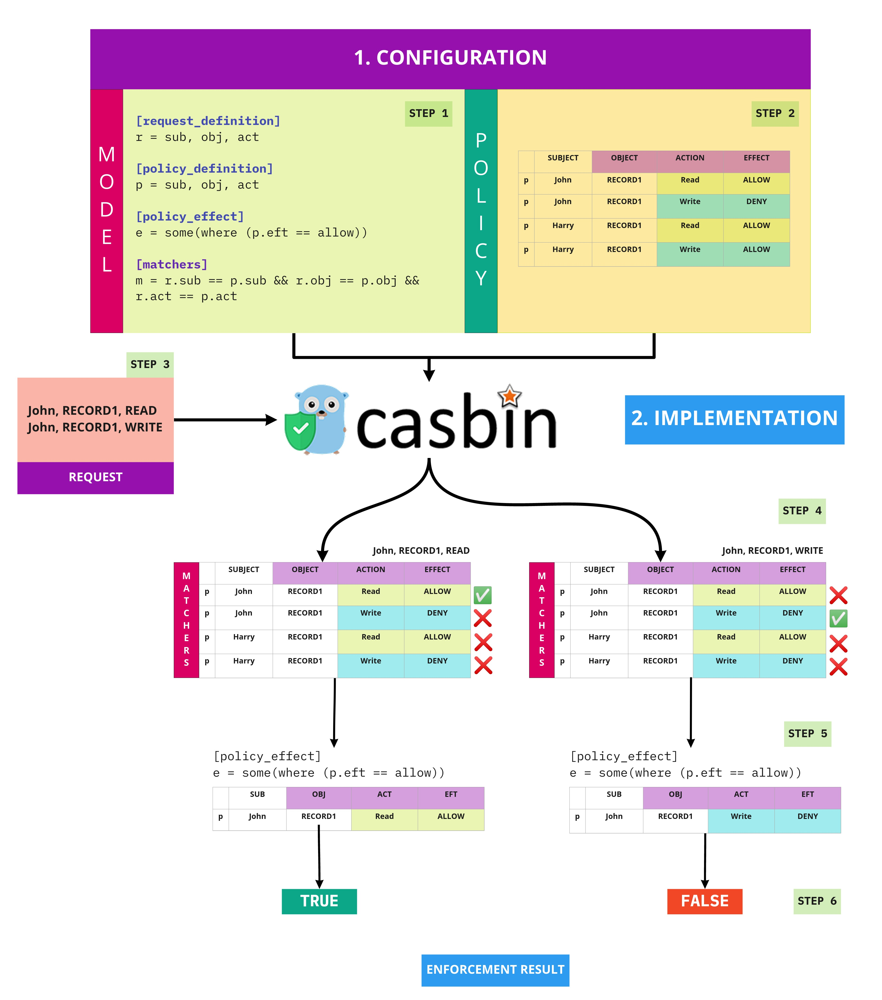

## Implementation of casbin on golang gorm projects

### Go through my article on [Understanding Casbin with different Access Control Model Configurations](https://medium.com/wesionary-team/understanding-casbin-with-different-access-control-model-configurations-faebc60f6da5) 

### Running Project

1. create Database `casbin-golang`
2. run `go run main`

### Casbin Workflow

### Middleware Casbin 

